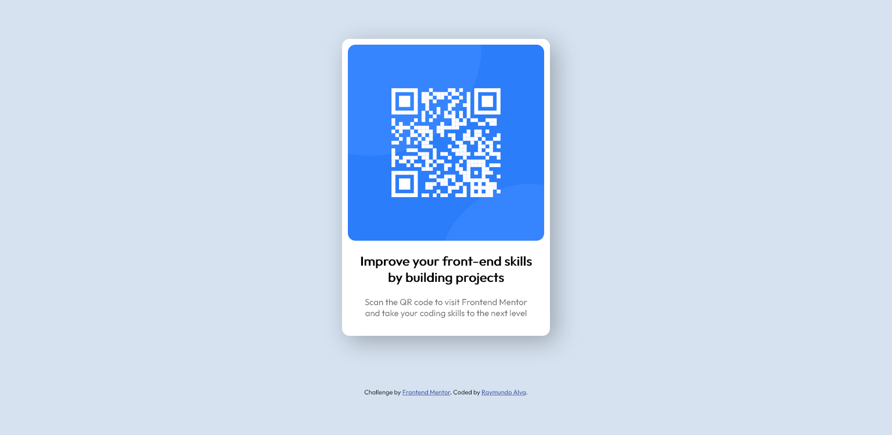

# Frontend Mentor - QR code component solution

This is a solution to the [QR code component challenge on Frontend Mentor](https://www.frontendmentor.io/challenges/qr-code-component-iux_sIO_H). Frontend Mentor challenges help you improve your coding skills by building realistic projects. 

## Table of contents

- [Overview](#overview)
  - [Screenshot](#screenshot)
  - [Links](#links)
- [My process](#my-process)
  - [Built with](#built-with)
  - [What I learned](#what-i-learned)
  - [Continued development](#continued-development)
  - [Useful resources](#useful-resources)
- [Author](#author)

## Overview

### Screenshot

### Links

- Solution URL: [Solution](https://www.frontendmentor.io/solutions/responsive-qr-code-component-using-flexbox-QqP1Od6vU)
- Live Site URL: [Live Site](https://rayalva407.github.io/QR-Code-Component/)

## My process

### Built with

- Semantic HTML5 markup
- Flexbox
- Responsive design

### What I learned

In this project I was very familiar with most of the concepts but I did learn about using relative units in order to create a more responsive final product. Units like px have some limitations when your screen size changes. In this project I used relative units like % and rem.

### Continued development

In the future I hope to learn more about responsive design and use media queries more effectively. I also want to try my hand at designing a project using a mobile first approach.

### Useful resources

- [The CSS Layout Workshop: Relative Units](https://thecssworkshop.com/lessons/relative-units) - This lesson helped me learn about what relative units are and how they should be used. There are many relative units and it is important to know what each one can do for your use case.
- [W3Schools CSS Media Queries Examples](https://www.w3schools.com/Css/css3_mediaqueries_ex.asp) - W3Schools is a great resource for many programming related subjects. This specific page gives some good examples on Media Query uses. This gave me a great idea on how I can use Media Queries in future projects.

## Author

- Website - [Raymundo Alva](https://rayalva407.github.io/front)
- Github - [@rayalva407](https://github.com/rayalva407)
- Frontend Mentor - [@rayalva407](https://www.frontendmentor.io/profile/rayalva407)
